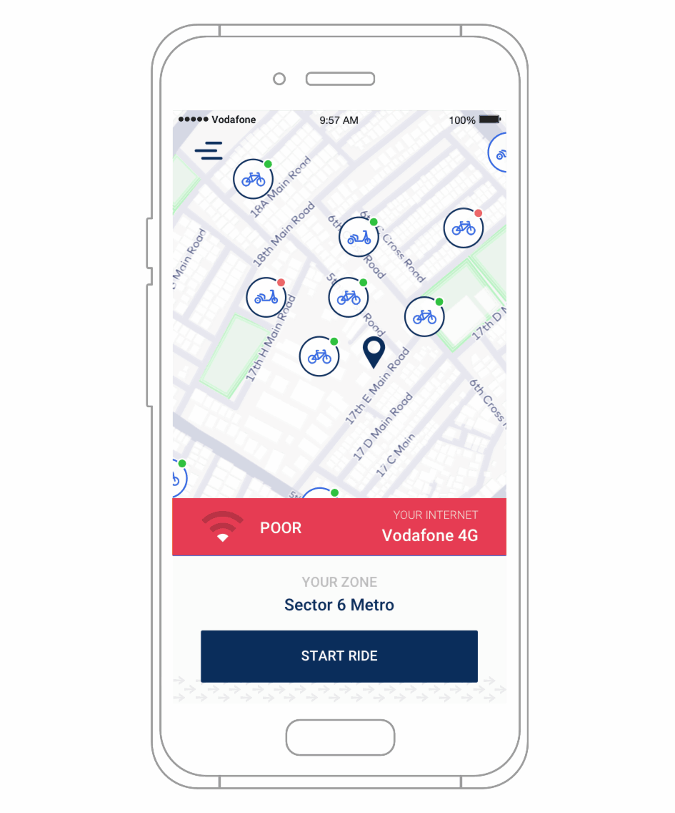

<!-- MarkdownTOC -->
- [Examples with Fastah Network Kit - Android](#list-of-examples)
- [Quick Start Guide](#quick-start-guide)
    - [Installation](#installation)
    - [Integration](#integration)
- [I want to know more!](#i-want-to-know-more)
- [Help](#want-to-report-a-problem)
- [License](#license)
<!-- /MarkdownTOC -->

<a name="list-of-examples"></a>
# Examples with Fastah API
This repository provides sample code to build network-aware Android apps using Fastah Network Kit for Android. 



* Simple [app](examples/app/src/main/java/com/getfastah/examples/) that uses [LiveData](https://developer.android.com/topic/libraries/architecture/livedata) to observe network latency using [NetworkLatencyLiveData.java](examples/app/src/main/java/com/getfastah/examples/NetworkLatencyLiveData.java)

<a name="installation"></a>
## Installation

### Dependencies in *app/build.gradle*

Add Fastah's Maven repository to the `repositories` section in *app/build.gradle*
```gradle
maven { url 'http://maven.getfastah.com/libs-release' }
```

Next, add Fastah to the `dependencies` section in *app/build.gradle*
```gradle
    // Fastah Network Kit core library
    implementation 'com.getfastah.networkkit:networkkit-android-core:1.9.20'
    // Fastah Network Kit dependencies
    implementation 'com.google.android.gms:play-services-location:17.1.0'
    implementation 'com.google.firebase:firebase-iid:21.0.1'
    implementation 'com.amazonaws:aws-android-sdk-core:2.19.4'
    implementation 'com.amazonaws:aws-android-sdk-kinesis:2.19.4'
```

<a name="integration"></a>
## Integration

### Configuration

Before using Fastah's `MeasureManager` interface, configure the app-specific key in the [app's AndroidManifest.xml](examples/app/src/main/AndroidManifest.xml). Replace `YOUR_APPLICATION_ID` and `YOUR_APPLICATION_KEY` with the application ID (e.g "com.mycompany") and the key (e.g `fnk.XYZ`), obtained from the welcome email sent from [support@getfastah.com](mailto:support@getfastah.com). Now, build your app. 

```xml
<meta-data android:name="com.getfastah.networkkit.MeasureConfig.ApplicationName" android:value="YOUR_APPLICATION_ID" />
<meta-data android:name="com.getfastah.networkkit.MeasureConfig.ApplicationKey" android:value="YOUR_APPLICATION_KEY" />
```

#### Permissions configuration
The following permissions are merged automatically via the library's own Manifest file via [Android's manifest merging](https://developer.android.com/studio/build/manifest-merge.html).
```xml
<!-- Normal permissions -->
<uses-permission android:name="android.permission.INTERNET" />
<uses-permission android:name="android.permission.ACCESS_NETWORK_STATE" />
<uses-permission android:name="android.permission.ACCESS_WIFI_STATE" />
<uses-permission android:name="android.permission.RECEIVE_BOOT_COMPLETED" />
<uses-permission android:name="android.permission.WAKE_LOCK" />
<!-- Special permissions -->
<uses-permission android:name="android.permission.ACCESS_FINE_LOCATION" />
<uses-permission android:name="android.permission.READ_PHONE_STATE" />
```

#### Network security configuration
Ensure that your Manifest mentions an app-level [Android-standard network security configuration XML](https://developer.android.com/training/articles/security-config). For this, one needs to create a [res/xml/network_security_config.xml](examples/app/src/main/res/xml/network_security_config.xml) file and mention it in the Manifest's application attributes list as show below. 
```xml
<manifest ... >
    <application android:networkSecurityConfig="@xml/network_security_config"
    </application>
</manifest>
```

#### Allowing AWS Cloudfront for plain HTTP
While ensuring that the following matches your app's and organization security standards, add the following allow rule for non-encrypted HTTP to the [app/res/xml/network_security_config.xml](examples/app/src/main/res/xml/network_security_config.xml) file. This allows Fastah Network Kit to reach AWS Lamba@Edge edge locations for latency checks. 
```xml
<network-security-config>
    <!-- Add the single non-secure HTTP allow rule below for Fastah Network Kit network probes -->
    <domain-config cleartextTrafficPermitted="true">
        <domain includeSubdomains="true">cloudfront.net</domain>
    </domain-config>
</network-security-config>
```

### Running the application

Once you have configured the keys and configured security, you may launch the application, and monitor Fastah's initialization state using Android Studio's Logcat window: look for message prefix `FastahNetworkKit`.

To start using `MeasureManager`, use the `getInstance` accessor below, such as from within your [LiveData-derived class](examples/app/src/main/java/com/getfastah/examples/NetworkLatencyLiveData.java).

```java
MeasureManager.getInstance(getApplicationContext()).measureOnce();
```

### Network sensing & Network watching

With the `MeasureManager` object created in [the previous step](#integration) a call to `measureOnce` is all you need to start measuring network conditions using Fastah's geo-distributed server endpoints.

```java
MeasureManager.MeasurementCompletedListener mListener;
mListener = new MeasureManager.MeasurementCompletedListener() {
    @Override
    public void onMeasurementComplete(MeasureSample sample) {
        // The sample object holds the measurement results.
    }
};

MeasureManager.getInstance().register(mListener);

// Call this as often as you like to get real-time network conditions
MeasureManager.getInstance(ctx).measureOnce();
```

<a name="i-want-to-know-more"></a>
# I want to know more!

No worries, here are some links that you will find useful:
* **[Sample app](examples/app/src/main/java/com/getfastah/examples/)**
* **[Full API Reference](https://fastahproject.com/pub/fastah-sdk-android/javadoc/com/getfastah/networkkit/MeasureManager.html)**

Have any questions? Reach out to [support@getfastah.com](mailto:support@getfastah.com) to speak to someone smart, quickly.

<a name="want-to-report-a-problem"></a>
# Help

Please report any problems in this Github project's Issues section, or via email to [support@getfastah.com](mailto:support@getfastah.com). 
On Twitter, ping [@getfastah](https://twitter.com/getfastah)]

<a name="license"></a>
# License

```
See LICENSE File for details.
```
